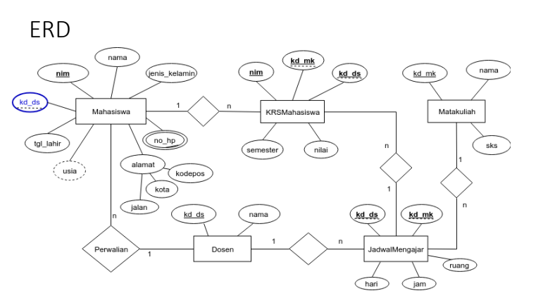
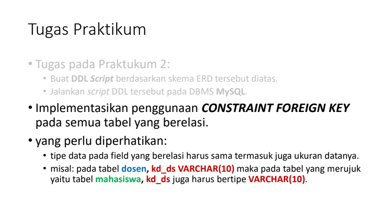
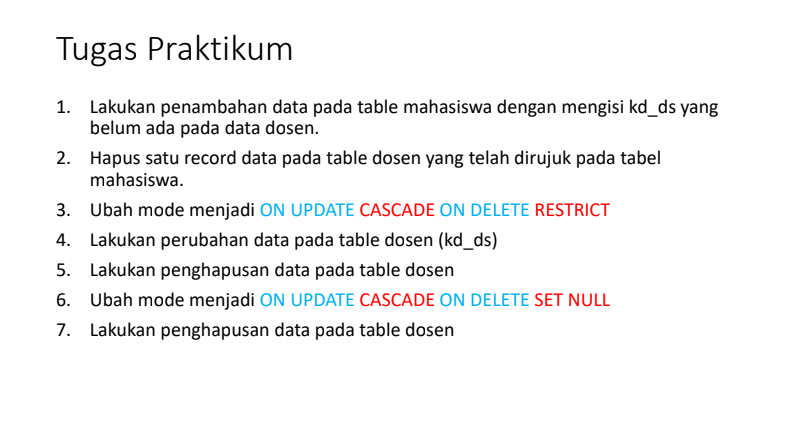

# Praktikum - 3

## SQL CONSTRAINT

- SQL constraint (atau batasan) adalah aturan atau kebijakan yang diterapkan pada kolom atau tabel dalam basis data SQL untuk memastikan integritas data dan menjaga konsistensi dan keakuratan informasi. 
- Constraint digunakan untuk membatasi nilai-nilai yang dapat dimasukkan ke dalam kolom atau tabel tertentu, serta untuk menjaga hubungan dan dependensi antara tabel dalam basis data.

## TUGAS PRAKTIKUM

## EVALUASI & PERTANYAAN

1. Apa bedanya penggunaan RESTRICT dan penggunaan CASCADE?

=> RESTRICT: Ketika penghapusan atau perubahan data yang memicu referensi tidak akan terjadi dan operasi akan menghasilkan kesalahan. Ini mengharuskan Anda untuk menyelesaikan masalah referensi terlebih dahulu sebelum melanjutkan dengan tindakan tersebut.

=> CASCADE: ketika data yang memiliki referensi dihapus atau diperbarui, tindakan tersebut juga akan secara otomatis menghapus atau memperbarui data yang bergantung pada referensi tersebut.

2. Berikan kesimpulan anda!

=> Pemilihan antara "RESTRICT" dan "CASCADE" tergantung pada kebutuhan dan tujuan pengembangan basis data. Jika Anda ingin menjaga integritas data dengan ketat dan mencegah operasi yang melanggar ketergantungan, "RESTRICT" dapat digunakan. Di sisi lain, jika Anda ingin perubahan dalam satu objek mempengaruhi objek terkait dan melakukan tindakan yang sesuai, "CASCADE" dapat digunakan.